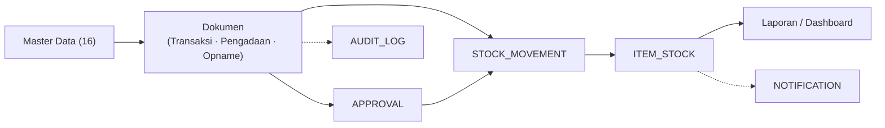
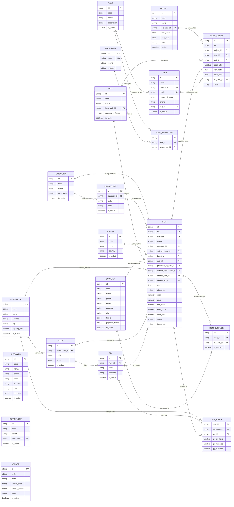
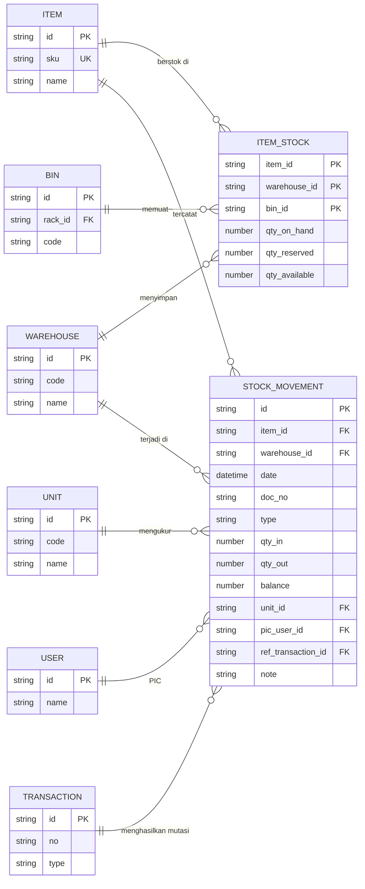
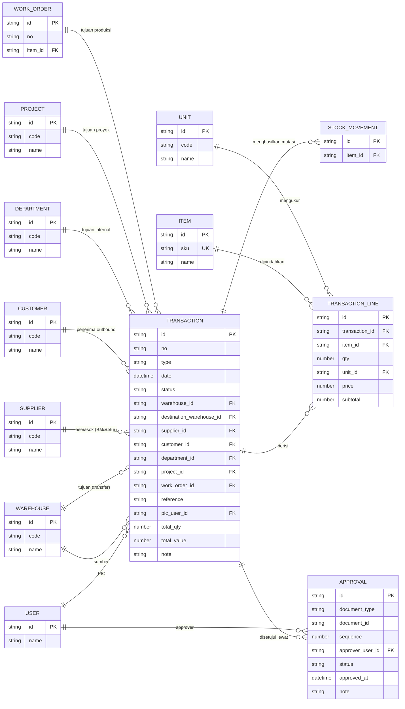
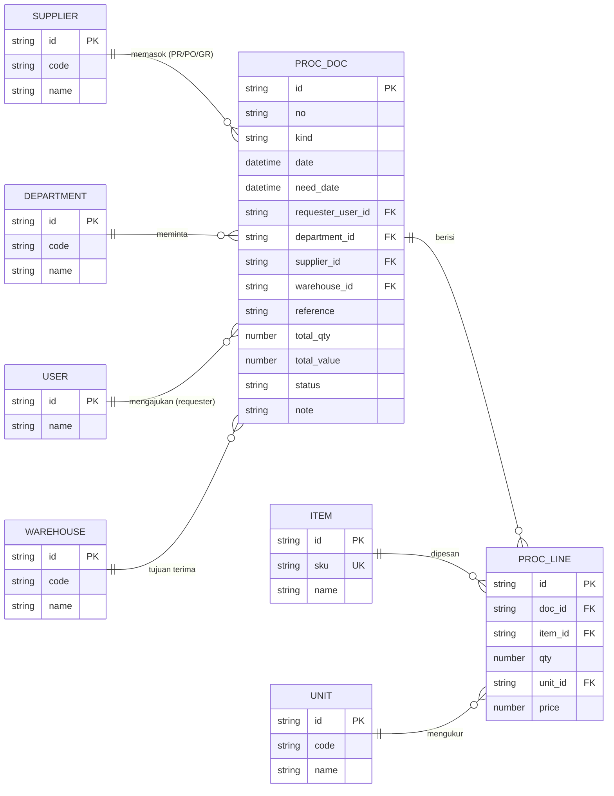
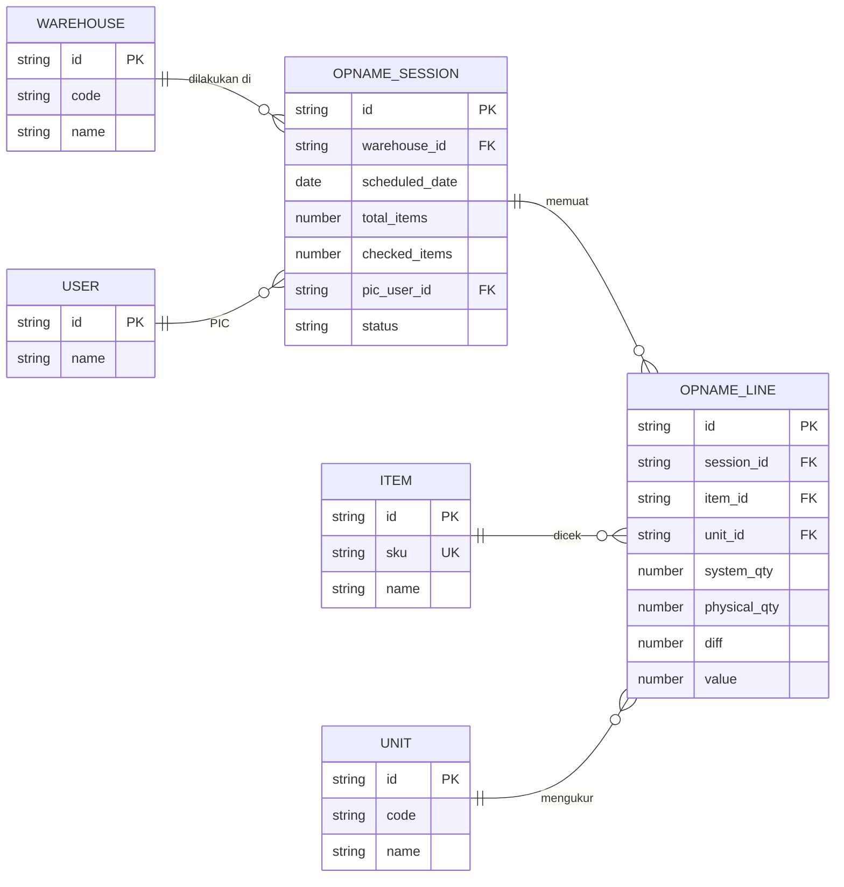
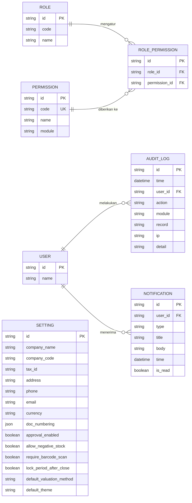

# ERD Komprehensif — KelolaGudang Pro

> Entity-Relationship Diagram **seluruh aplikasi** (8 domain), bukan hanya master data. Konteks: proyek UI-only; seluruh data dummy deterministik di `src/lib/wms-data.ts`. Dokumen ini adalah **target schema normalisasi** — banyak entitas masih denormalized di kode (lihat §6). Dokumen `docs/erd-master-data.md` adalah subset master dari dokumen ini.

## 1. Ringkasan & Cakupan

| Domain                        | Entitas          | Modul                                |
| ----------------------------- | ---------------- | ------------------------------------ |
| Master Data                   | 16               | `/master/*`                          |
| Persediaan (Inventory)        | 2                | `/persediaan/*`                      |
| Transaksi                     | 3                | `/transaksi/*`                       |
| Pengadaan (Procurement)       | 2                | `/pengadaan/*`                       |
| Stock Opname                  | 2                | `/opname/*`                          |
| System & Keamanan             | 4                | `/system/*`, `/pengaturan`, `/login` |
| Notifikasi                    | 1                | header app (Notification Center)     |
| Jembatan M:N                  | 1                | `ITEM_SUPPLIER` (Item–Supplier)      |
| Laporan / Barcode / Dashboard | — (derived view) | `/laporan/*`, `/barcode`, `/`        |

Total **31 entitas** (16 master + 15 operasional/penunjang).

## 2. Alur & Diagram ERD

### 2.1 Alur lintas domain (ringkas)

> Alur: master data menjadi fondasi dokumen; dokumen yang sudah melewati `APPROVAL` diposting sebagai `STOCK_MOVEMENT` (mutasi stok) yang mengoreksi `ITEM_STOCK`; hasilnya direkap di laporan/dashboard. Setiap aksi dicatat di `AUDIT_LOG`; stok menipis/dokumen selesai memicu `NOTIFICATION`.

### 2.2 Diagram per domain (urut alur)

Diagram disusun mengikuti alur bisnis: **Master Data → Persediaan → Transaksi → Pengadaan → Stock Opname → System & Notifikasi**. Entitas milik domain ditampilkan dengan kolom lengkap; entitas lintas domain yang direferensi (konteks) ditampilkan ringkas (PK + identitas) agar diagram tetap fokus.

#### 2.2.1 Master Data (16 + 4 jembatan)

#### 2.2.2 Persediaan

#### 2.2.3 Transaksi

#### 2.2.4 Pengadaan

#### 2.2.5 Stock Opname

#### 2.2.6 System & Notifikasi

### 2.3 Diagram penuh (31 entitas, referensi)

Gabungan seluruh domain dalam satu diagram (self-contained, semua blok berkolom lengkap). Diagram §2.2 lebih mudah dibaca per alur; diagram ini untuk referensi struktur menyeluruh.

```mermaid
erDiagram
  direction LR
  %% ===== MASTER DATA — klasifikasi & identitas =====
  CATEGORY ||--o{ SUBCATEGORY : "memiliki"
  SUBCATEGORY ||--o{ ITEM : "menurunkan"
  CATEGORY ||--o{ ITEM : "mengklasifikasi"
  BRAND ||--o{ ITEM : "memproduksi"
  UNIT ||--o{ ITEM : "mengukur"

  %% ===== MASTER DATA — pemasok =====
  SUPPLIER ||--o{ ITEM : "pemasok utama"
  ITEM ||--o{ ITEM_SUPPLIER : "memiliki banyak"
  SUPPLIER ||--o{ ITEM_SUPPLIER : "memasok ke"

  %% ===== MASTER DATA — lokasi penyimpanan =====
  WAREHOUSE ||--o{ RACK : "menaungi"
  RACK ||--o{ BIN : "berisi"
  WAREHOUSE ||--o{ ITEM : "gudang default"
  RACK ||--o{ ITEM : "rak default"
  BIN ||--o{ ITEM : "bin default"

  %% ===== MASTER DATA — produksi & akses =====
  PROJECT ||--o{ WORK_ORDER : "mewadahi"
  UNIT ||--o{ WORK_ORDER : "mengukur"
  ITEM ||--o{ WORK_ORDER : "diproduksi lewat"
  USER ||--o{ WORK_ORDER : "menangani PIC"
  ROLE ||--o{ USER : "memberi akses"

  %% ===== PERSEDIAAN =====
  ITEM ||--o{ ITEM_STOCK : "berstok di"
  WAREHOUSE ||--o{ ITEM_STOCK : "menyimpan"
  BIN ||--o{ ITEM_STOCK : "memuat"
  ITEM ||--o{ STOCK_MOVEMENT : "tercatat"
  WAREHOUSE ||--o{ STOCK_MOVEMENT : "terjadi di"
  UNIT ||--o{ STOCK_MOVEMENT : "mengukur"
  USER ||--o{ STOCK_MOVEMENT : "PIC"
  TRANSACTION ||--o{ STOCK_MOVEMENT : "menghasilkan mutasi"

  %% ===== TRANSAKSI =====
  USER ||--o{ TRANSACTION : "PIC"
  WAREHOUSE ||--o{ TRANSACTION : "sumber"
  WAREHOUSE ||--o{ TRANSACTION : "tujuan (transfer)"
  SUPPLIER ||--o{ TRANSACTION : "pemasok (BM/Retur)"
  CUSTOMER ||--o{ TRANSACTION : "penerima outbound"
  DEPARTMENT ||--o{ TRANSACTION : "tujuan internal"
  PROJECT ||--o{ TRANSACTION : "tujuan proyek"
  WORK_ORDER ||--o{ TRANSACTION : "tujuan produksi"
  TRANSACTION ||--o{ TRANSACTION_LINE : "berisi"
  ITEM ||--o{ TRANSACTION_LINE : "dipindahkan"
  UNIT ||--o{ TRANSACTION_LINE : "mengukur"
  TRANSACTION ||--o{ APPROVAL : "disetujui lewat"
  USER ||--o{ APPROVAL : "approver"

  %% ===== PENGADAAN =====
  SUPPLIER ||--o{ PROC_DOC : "memasok (PR/PO/GR)"
  DEPARTMENT ||--o{ PROC_DOC : "meminta"
  USER ||--o{ PROC_DOC : "mengajukan (requester)"
  WAREHOUSE ||--o{ PROC_DOC : "tujuan terima"
  PROC_DOC ||--o{ PROC_LINE : "berisi"
  ITEM ||--o{ PROC_LINE : "dipesan"
  UNIT ||--o{ PROC_LINE : "mengukur"

  %% ===== OPNAME =====
  WAREHOUSE ||--o{ OPNAME_SESSION : "dilakukan di"
  USER ||--o{ OPNAME_SESSION : "PIC"
  OPNAME_SESSION ||--o{ OPNAME_LINE : "memuat"
  ITEM ||--o{ OPNAME_LINE : "dicek"
  UNIT ||--o{ OPNAME_LINE : "mengukur"

  %% ===== SYSTEM & NOTIFIKASI =====
  ROLE ||--o{ ROLE_PERMISSION : "mengatur"
  PERMISSION ||--o{ ROLE_PERMISSION : "diberikan ke"
  USER ||--o{ AUDIT_LOG : "melakukan"
  USER ||--o{ NOTIFICATION : "menerima"

  %% SETTING = profil perusahaan (singleton) + preferensi operasional;
  %% tema pengguna disimpan client-side di localStorage (key `kg-theme`),
  %% bukan di SETTING — karenanya tidak ada relasi SETTING—USER.

  %% ===== BLOK ENTITAS (31) =====

  %% --- Master Data (16) ---
  CATEGORY {
    string id PK
    string code
    string name
    string description
    boolean is_active
  }
  SUBCATEGORY {
    string id PK
    string category_id FK
    string code
    string name
    boolean is_active
  }
  BRAND {
    string id PK
    string code
    string name
    string country
    boolean is_active
  }
  UNIT {
    string id PK
    string code
    string name
    string base_unit_id FK
    number conversion_factor
    boolean is_active
  }
  WAREHOUSE {
    string id PK
    string code
    string name
    string address
    string city
    number capacity_m3
    boolean is_active
  }
  RACK {
    string id PK
    string warehouse_id FK
    string code
    string zone
    boolean is_active
  }
  BIN {
    string id PK
    string rack_id FK
    string code
    string capacity
    boolean is_active
  }
  ITEM {
    string id PK
    string sku UK
    string barcode UK
    string name
    string category_id FK
    string sub_category_id FK
    string brand_id FK
    string unit_id FK
    string preferred_supplier_id FK
    string default_warehouse_id FK
    string default_rack_id FK
    string default_bin_id FK
    float weight
    string dimension
    number cost
    number price
    number min_stock
    number max_stock
    number lead_time
    string status
    string image_url
  }
  SUPPLIER {
    string id PK
    string code
    string name
    string phone
    string email
    string address
    string city
    string tax_id
    string payment_terms
    boolean is_active
  }
  CUSTOMER {
    string id PK
    string code
    string name
    string phone
    string email
    string address
    string city
    string segment
    boolean is_active
  }
  DEPARTMENT {
    string id PK
    string code
    string name
    string head_user_id FK
    boolean is_active
  }
  PROJECT {
    string id PK
    string code
    string name
    string pic_user_id FK
    date start_date
    date end_date
    string status
    number budget
  }
  WORK_ORDER {
    string id PK
    string no
    string project_id FK
    string item_id FK
    string unit_id FK
    number target_qty
    date start_date
    date finish_date
    string pic_user_id FK
    string status
  }
  USER {
    string id PK
    string name
    string username UK
    string email UK
    string password_hash
    string phone
    string role_id FK
    boolean is_active
  }
  ROLE {
    string id PK
    string code
    string name
    string description
    boolean is_active
  }
  VENDOR {
    string id PK
    string code
    string name
    string service_type
    string contact_phone
    string email
    boolean is_active
  }

  %% --- Persediaan (2) ---
  %% PK komposit (item_id, warehouse_id, bin_id); bin_id opsional bila tanpa bin; qty_available = on_hand − reserved
  ITEM_STOCK {
    string item_id PK
    string warehouse_id PK
    string bin_id PK
    number qty_on_hand
    number qty_reserved
    number qty_available
  }
  STOCK_MOVEMENT {
    string id PK
    string item_id FK
    string warehouse_id FK
    datetime date
    string doc_no
    string type
    number qty_in
    number qty_out
    number balance
    string unit_id FK
    string pic_user_id FK
    string ref_transaction_id FK
    string note
  }

  %% --- Transaksi (3) ---
  TRANSACTION {
    string id PK
    string no
    string type
    datetime date
    string status
    string warehouse_id FK
    string destination_warehouse_id FK
    string supplier_id FK
    string customer_id FK
    string department_id FK
    string project_id FK
    string work_order_id FK
    string reference
    string pic_user_id FK
    number total_qty
    number total_value
    string note
  }
  TRANSACTION_LINE {
    string id PK
    string transaction_id FK
    string item_id FK
    number qty
    string unit_id FK
    number price
    number subtotal
  }
  APPROVAL {
    string id PK
    string document_type
    string document_id
    number sequence
    string approver_user_id FK
    string status
    datetime approved_at
    string note
  }

  %% --- Pengadaan (2) ---
  PROC_DOC {
    string id PK
    string no
    string kind
    datetime date
    datetime need_date
    string requester_user_id FK
    string department_id FK
    string supplier_id FK
    string warehouse_id FK
    string reference
    number total_qty
    number total_value
    string status
    string note
  }
  PROC_LINE {
    string id PK
    string doc_id FK
    string item_id FK
    number qty
    string unit_id FK
    number price
  }

  %% --- Stock Opname (2) ---
  OPNAME_SESSION {
    string id PK
    string warehouse_id FK
    date scheduled_date
    number total_items
    number checked_items
    string pic_user_id FK
    string status
  }
  OPNAME_LINE {
    string id PK
    string session_id FK
    string item_id FK
    string unit_id FK
    number system_qty
    number physical_qty
    number diff
    number value
  }

  %% --- System & Keamanan (4) ---
  PERMISSION {
    string id PK
    string code UK
    string name
    string module
  }
  ROLE_PERMISSION {
    string id PK
    string role_id FK
    string permission_id FK
  }
  AUDIT_LOG {
    string id PK
    datetime time
    string user_id FK
    string action
    string module
    string record
    string ip
    string detail
  }
  SETTING {
    string id PK
    string company_name
    string company_code
    string tax_id
    string address
    string phone
    string email
    string currency
    json doc_numbering
    boolean approval_enabled
    boolean allow_negative_stock
    boolean require_barcode_scan
    boolean lock_period_after_close
    string default_valuation_method
    string default_theme
  }

  %% --- Notifikasi (1) ---
  NOTIFICATION {
    string id PK
    string user_id FK
    string type
    string title
    string body
    datetime time
    boolean is_read
  }

  %% --- Jembatan M:N (1) ---
  ITEM_SUPPLIER {
    string id PK
    string item_id FK
    string supplier_id FK
    boolean is_primary
  }
```

## 3. Detail Atribut per Domain

### 3.1 Master Data (16)

Diagram master: **§2.2.1**; detail atribut lengkap di dokumen terpisah `docs/erd-master-data.md`. Ringkasan relasi:

- `CATEGORY` 1—N `SUBCATEGORY` 1—N `ITEM`
- `BRAND` 1—N `ITEM`; `UNIT` 1—N `ITEM`
- `WAREHOUSE` 1—N `RACK` 1—N `BIN`; ketiganya → `ITEM` (lokasi default)
- `SUPPLIER` 1—N `ITEM` (pemasok utama) dan M—N via `ITEM_SUPPLIER` (multi-pemasok); `CUSTOMER` → konsumsi via `TRANSACTION`
- `DEPARTMENT`, `PROJECT`, `WORK_ORDER`, `VENDOR` (orphan/opsional)
- `ROLE` 1—N `USER`

### 3.2 Persediaan

**ITEM_STOCK** — posisi stok per lokasi (saat ini denormalized di `Item.stock/reserved`)

| Atribut         | Tipe           | Ket                                   |
| --------------- | -------------- | ------------------------------------- |
| `item_id`       | FK → ITEM      | PK komposit                           |
| `warehouse_id`  | FK → WAREHOUSE | PK komposit                           |
| `bin_id`        | FK → BIN       | PK komposit (opsional bila tanpa bin) |
| `qty_on_hand`   | number         | stok fisik                            |
| `qty_reserved`  | number         | stok dikunci                          |
| `qty_available` | derived        | `on_hand - reserved`                  |

**STOCK_MOVEMENT** — kartu stock / mutasi per barang (saat ini di-generate `stockCard()`)

| Atribut              | Tipe             | Ket                              |
| -------------------- | ---------------- | -------------------------------- |
| `id`                 | PK               |                                  |
| `item_id`            | FK → ITEM        |                                  |
| `warehouse_id`       | FK → WAREHOUSE   |                                  |
| `date`               | datetime         |                                  |
| `doc_no`             | string           | nomor dokumen sumber             |
| `type`               | string           | "Barang Masuk"/"Barang Keluar"/… |
| `qty_in`             | number           | 0 bila keluar                    |
| `qty_out`            | number           | 0 bila masuk                     |
| `balance`            | number           | saldo berjalan                   |
| `unit_id`            | FK → UNIT        |                                  |
| `pic_user_id`        | FK → USER        |                                  |
| `ref_transaction_id` | FK → TRANSACTION | sumber dokumen                   |
| `note`               | string           |                                  |

### 3.3 Transaksi

**TRANSACTION** — header (sumber: `Trx`, `wms-data.ts:249-335`)

| Atribut                    | Tipe            | Ket                                       |
| -------------------------- | --------------- | ----------------------------------------- |
| `id`                       | PK              |                                           |
| `no`                       | string          | `BM/2026/00123` (prefix per type)         |
| `type`                     | enum TrxType    | lihat §4                                  |
| `date`                     | datetime        |                                           |
| `status`                   | enum            | lihat §4                                  |
| `warehouse_id`             | FK → WAREHOUSE  | gudang sumber                             |
| `destination_warehouse_id` | FK → WAREHOUSE  | nullable; hanya Transfer Gudang           |
| `supplier_id`              | FK → SUPPLIER   | nullable; Barang Masuk / Retur Pembelian  |
| `customer_id`              | FK → CUSTOMER   | nullable; Barang Keluar / Retur Penjualan |
| `department_id`            | FK → DEPARTMENT | nullable; tujuan internal                 |
| `project_id`               | FK → PROJECT    | nullable; tujuan produksi                 |
| `work_order_id`            | FK → WORK_ORDER | nullable; produksi                        |
| `reference`                | string          | PO / SJ / WO                              |
| `pic_user_id`              | FK → USER       |                                           |
| `total_qty`                | number          | derived dari lines                        |
| `total_value`              | number          | derived dari lines                        |
| `note`                     | string          |                                           |

**TRANSACTION_LINE** — detail barang (sumber: `Trx.lines`)

| Atribut          | Tipe             | Ket           |
| ---------------- | ---------------- | ------------- |
| `id`             | PK               |               |
| `transaction_id` | FK → TRANSACTION |               |
| `item_id`        | FK → ITEM        |               |
| `qty`            | number           |               |
| `unit_id`        | FK → UNIT        |               |
| `price`          | number           |               |
| `subtotal`       | number           | `qty × price` |

**APPROVAL** — workflow persetujuan (status "Menunggu Approval" di UI)

| Atribut            | Tipe      | Ket                             |
| ------------------ | --------- | ------------------------------- |
| `id`               | PK        |                                 |
| `document_type`    | enum      | TRANSACTION / PROC_DOC / OPNAME |
| `document_id`      | string    | referensi polimorfik            |
| `sequence`         | number    | urutan approval                 |
| `approver_user_id` | FK → USER |                                 |
| `status`           | enum      | Menunggu / Disetujui / Ditolak  |
| `approved_at`      | datetime  |                                 |
| `note`             | string    |                                 |

### 3.4 Pengadaan — satu tabel PROC_DOC (sesuai kode `ProcDoc`)

**PROC_DOC** — header PR/PO/GR (field `kind`)

| Atribut             | Tipe            | Ket                                  |
| ------------------- | --------------- | ------------------------------------ |
| `id`                | PK              |                                      |
| `no`                | string          | `PR/2026/0001`                       |
| `kind`              | enum            | PR / PO / GR                         |
| `date`              | datetime        |                                      |
| `need_date`         | datetime        | tanggal kebutuhan                    |
| `requester_user_id` | FK → USER       |                                      |
| `department_id`     | FK → DEPARTMENT |                                      |
| `supplier_id`       | FK → SUPPLIER   |                                      |
| `warehouse_id`      | FK → WAREHOUSE  | tujuan terima                        |
| `reference`         | string          | PR→`BUDGET-XXXX`, PO→no PR, GR→no PO |
| `total_qty`         | number          | derived                              |
| `total_value`       | number          | derived                              |
| `status`            | enum            | per kind, lihat §4                   |
| `note`              | string          |                                      |

**PROC_LINE** — detail barang (sumber: `ProcLine`)

| Atribut   | Tipe          | Ket |
| --------- | ------------- | --- |
| `id`      | PK            |     |
| `doc_id`  | FK → PROC_DOC |     |
| `item_id` | FK → ITEM     |     |
| `qty`     | number        |     |
| `unit_id` | FK → UNIT     |     |
| `price`   | number        |     |

### 3.5 Stock Opname

**OPNAME_SESSION** (sumber: `opnameSessions`)

| Atribut          | Tipe           | Ket                              |
| ---------------- | -------------- | -------------------------------- |
| `id`             | PK             | `OPN-2026-001`                   |
| `warehouse_id`   | FK → WAREHOUSE |                                  |
| `scheduled_date` | date           |                                  |
| `total_items`    | number         |                                  |
| `checked_items`  | number         | progress                         |
| `pic_user_id`    | FK → USER      |                                  |
| `status`         | enum           | Berjalan / Dijadwalkan / Selesai |

**OPNAME_LINE** (sumber: `opnameLines()`)

| Atribut        | Tipe                | Ket                         |
| -------------- | ------------------- | --------------------------- |
| `id`           | PK                  |                             |
| `session_id`   | FK → OPNAME_SESSION |                             |
| `item_id`      | FK → ITEM           |                             |
| `unit_id`      | FK → UNIT           |                             |
| `system_qty`   | number              | stok di sistem              |
| `physical_qty` | number              | stok fisik hasil hitung     |
| `diff`         | number              | derived `physical - system` |
| `value`        | number              | `diff × cost`               |

### 3.6 System & Keamanan

**PERMISSION** — hak per modul

| Atribut  | Tipe      |
| -------- | --------- |
| `id`     | PK        |
| `code`   | string UK |
| `name`   | string    |
| `module` | string    |

**ROLE_PERMISSION** — jembatan

| Atribut         | Tipe            |
| --------------- | --------------- |
| `id`            | PK              |
| `role_id`       | FK → ROLE       |
| `permission_id` | FK → PERMISSION |

**AUDIT_LOG** (sumber: `auditLogs`, `wms-data.ts:640-671`)

| Atribut   | Tipe      | Ket                                       |
| --------- | --------- | ----------------------------------------- |
| `id`      | PK        |                                           |
| `time`    | datetime  |                                           |
| `user_id` | FK → USER |                                           |
| `action`  | enum      | Create/Update/Delete/Approve/Login/Export |
| `module`  | string    | Master Barang, Barang Masuk, …            |
| `record`  | string    | nomor dokumen yang diubah                 |
| `ip`      | string    |                                           |
| `detail`  | string    |                                           |

**SETTING / COMPANY_PROFILE** (sumber: `system.$section.tsx` GeneralSetting, `pengaturan.tsx`)

| Atribut                      | Tipe    | Ket                                                                                                                  |
| ---------------------------- | ------- | -------------------------------------------------------------------------------------------------------------------- |
| `id`                         | PK      | singleton                                                                                                            |
| `company_name`               | string  | "PT Kelola Nusantara"                                                                                                |
| `company_code`               | string  |                                                                                                                      |
| `tax_id`                     | string  | NPWP                                                                                                                 |
| `address`                    | string  |                                                                                                                      |
| `phone`, `email`, `currency` | string  |                                                                                                                      |
| `doc_numbering`              | json    | format per prefix `{PREFIX}/{YYYY}/{00000}`                                                                          |
| `approval_enabled`           | boolean | approval berjenjang                                                                                                  |
| `allow_negative_stock`       | boolean |                                                                                                                      |
| `require_barcode_scan`       | boolean |                                                                                                                      |
| `lock_period_after_close`    | boolean |                                                                                                                      |
| `default_valuation_method`   | enum    | FIFO / Average / Maximum Cost                                                                                        |
| `default_theme`              | string  | tema default app (`sky`); tema per-user via `localStorage` `kg-theme` (`src/components/wms/theme.tsx`) — bukan tabel |

> Catatan: `SETTING` adalah singleton profil perusahaan + preferensi operasional (dari halaman General Setting). Tema pastel per pengguna tidak disimpan di database — murni client-side. Bila backend diaktifkan, pisahkan ke tabel `USER_SETTING` bila ingin persistensi per user.

### 3.7 Notifikasi

**NOTIFICATION** (sumber: `notifications`, `app-shell.tsx`)

| Atribut   | Tipe      | Ket                                                                 |
| --------- | --------- | ------------------------------------------------------------------- |
| `id`      | PK        |                                                                     |
| `user_id` | FK → USER |                                                                     |
| `type`    | enum      | LowStock / BarangMasuk / TransferSelesai / OpnameSelesai / Approval |
| `title`   | string    |                                                                     |
| `body`    | string    |                                                                     |
| `time`    | datetime  |                                                                     |
| `is_read` | boolean   |                                                                     |

## 4. Enum & Status (dari kode)

| Enum                | Nilai                                                                                                          | Sumber                |
| ------------------- | -------------------------------------------------------------------------------------------------------------- | --------------------- |
| `TrxType`           | Barang Masuk, Barang Keluar, Transfer Gudang, Stock Adjustment, Stock Opname, Retur Pembelian, Retur Penjualan | `wms-data.ts:240-247` |
| `Trx.status`        | Draft, Menunggu Approval, Selesai, Dibatalkan, Dalam Perjalanan                                                | `wms-data.ts:260`     |
| `ProcDoc.status` PR | Draft, Menunggu Approval, Disetujui, Ditolak                                                                   | `wms-data.ts:575`     |
| `ProcDoc.status` PO | Menunggu Approval, Disetujui, Sebagian Diterima, Selesai, Dibatalkan                                           | `wms-data.ts:576`     |
| `ProcDoc.status` GR | Draft, Sebagian Diterima, Selesai                                                                              | `wms-data.ts:577`     |
| `Opname.status`     | Berjalan, Dijadwalkan, Selesai                                                                                 | `wms-data.ts:421-423` |
| `WorkOrder.status`  | Perencanaan, Berjalan, Selesai, Ditunda                                                                        | `wms-data.ts:490`     |
| `Moving`            | Fast (<20 hari), Medium, Slow, Dead (>150 hari)                                                                | `wms-data.ts:227`     |
| `ValuationMethod`   | FIFO, Average, Maximum Cost                                                                                    | `wms-data.ts:472`     |
| `AuditAction`       | Create, Update, Delete, Approve, Login, Export                                                                 | `wms-data.ts:633`     |
| `Item.status`       | Aktif, Nonaktif                                                                                                | `wms-data.ts:146`     |

## 5. Relasi Lintas Domain & Alur Posting

> **Flow target, belum diimplementasikan** — aplikasi UI-only; alur berikut adalah desain posting stok yang akan berlaku saat backend diaktifkan.

| Alur bisnis             | Alur data                                                                                                      |
| ----------------------- | -------------------------------------------------------------------------------------------------------------- |
| Barang Masuk (diterima) | `TRANSACTION(type=BM)` → `STOCK_MOVEMENT(qty_in)` → `ITEM_STOCK.qty_on_hand +`                                 |
| Barang Keluar (dikirim) | `TRANSACTION(type=BK)` → `STOCK_MOVEMENT(qty_out)` → `ITEM_STOCK.qty_on_hand −`                                |
| Transfer Gudang         | 1 `TRANSACTION(type=TF)` → 2 `STOCK_MOVEMENT` (out di gudang asal, in di gudang tujuan)                        |
| Receive Goods (GR)      | `PROC_DOC(kind=GR)` mereferensi `PROC_DOC(kind=PO)` → sama seperti Barang Masuk                                |
| Stock Adjustment        | `TRANSACTION(type=Adjustment)` mengoreksi `ITEM_STOCK` (penyusutan/penambahan)                                 |
| Stock Opname            | `OPNAME_LINE.diff ≠ 0` → generate `TRANSACTION(type=Stock Adjustment)` → `ITEM_STOCK`                          |
| Retur Pembelian         | `TRANSACTION(type=Retur Pembelian)` → keluar ke supplier → `ITEM_STOCK −`                                      |
| Retur Penjualan         | `TRANSACTION(type=Retur Penjualan)` → masuk dari customer → `ITEM_STOCK +`                                     |
| Approval                | `APPROVAL` memfilter TRANSACTION/PROC_DOC sebelum status menjadi Selesai/Disetujui                             |
| Audit & Notifikasi      | `AUDIT_LOG` mencatat setiap aksi; `NOTIFICATION` dibangkitkan dari LowStock, dokumen selesai, pending approval |

## 6. Mapping Kode Saat Ini → ERD

| Tipe/field di kode                              | Lokasi                | Normalisasi menjadi                                                       |
| ----------------------------------------------- | --------------------- | ------------------------------------------------------------------------- |
| `Item.stock` / `Item.reserved`                  | `wms-data.ts:136-137` | `ITEM_STOCK.qty_on_hand` / `qty_reserved`                                 |
| `Item.warehouse/rack/bin` (string)              | `wms-data.ts:133-135` | FK → WAREHOUSE / RACK / BIN                                               |
| `Item.category/subCategory/brand/supplier/unit` | `wms-data.ts:129-138` | FK → entitas master; supplier → `preferred_supplier_id` + `ITEM_SUPPLIER` |
| `Trx` + `Trx.lines`                             | `wms-data.ts:249-335` | `TRANSACTION` + `TRANSACTION_LINE`                                        |
| `stockCard()` / `StockCardRow`                  | `wms-data.ts:428-449` | `STOCK_MOVEMENT`                                                          |
| `trxFromStockCard()`                            | `wms-data.ts:454-470` | penggabungan TRANSACTION dari STOCK_MOVEMENT                              |
| `ProcDoc` + `ProcLine` (PR/PO/GR)               | `wms-data.ts:549-620` | `PROC_DOC` (kind) + `PROC_LINE`                                           |
| `opnameSessions` / `opnameLines()`              | `wms-data.ts:410-538` | `OPNAME_SESSION` + `OPNAME_LINE`                                          |
| `auditLogs`                                     | `wms-data.ts:640-671` | `AUDIT_LOG`                                                               |
| `notifications`                                 | `wms-data.ts:372-408` | `NOTIFICATION`                                                            |
| `pics` (array nama)                             | `wms-data.ts:265-272` | `USER`                                                                    |
| `valuationMethods` / `valuationFactor`          | `wms-data.ts:472-478` | `SETTING.default_valuation_method`                                        |
| `monthly`, `totalValue`, `activities`           | `wms-data.ts:337-370` | derived view (dashboard/laporan)                                          |

## 7. Keputusan Desain

1. **PROC_DOC tunggal** — PR/PO/GR dalam satu tabel dengan field `kind`, mengikuti implementasi kode. Alur `PR→PO→GR` dilacak lewat kolom `reference`.
2. **Skema target penuh** — tabel normalisasi (ITEM_STOCK, STOCK_MOVEMENT, APPROVAL, NOTIFICATION, PERMISSION, ROLE_PERMISSION, ITEM_SUPPLIER, SETTING) dimasukkan sebagai bagian ERD, meskipun belum ada eksplisit di kode.
3. **VENDOR tetap dipertahankan** sebagai entitas orphan/opsional — kode belum mereferensikannya.
4. **WORK_ORDER dipertahankan** — dipakai form Barang Keluar (tujuan produksi) dan menghubungkan PROYEK + UNIT + USER.
5. **Inkonsistensi Role** — master Role: Administrator/Supervisor/Operator Gudang/Auditor/Viewer; audit log memakai Admin/Purchasing. Perlu penyelarasan saat normalisasi.
6. **Polimorfik `APPROVAL.document_id`** — referensi dokumen lintas tipe (TRANSACTION/PROC_DOC/OPNAME); bisa diganti skema per-tipe bila diperlukan.
7. **Rak/Bin belum berelasi nyata ke Item** — tabel rak/bin di-generate mandiri (`generic-master.tsx:87-112`); `Item.rack/bin` dipilih acak sehingga tidak ada jaminan konsistensi dengan tabel rak/bin. Relasi pada diagram adalah target normalisasi.
8. **SubKategori↔Barang bukan relasi nyata** — keduanya dipilih acak di dummy data; label "Induk Kategori" di UI difabrikasi (`generic-master.tsx:50`). Relasi pada ERD adalah usulan normalisasi.
9. **Diagram §2.3 self-contained** — seluruh 31 entitas memiliki blok kolom lengkap (16 master + 15 operasional/penunjang) sehingga struktur entitas dapat dibaca tanpa dokumen lain.
