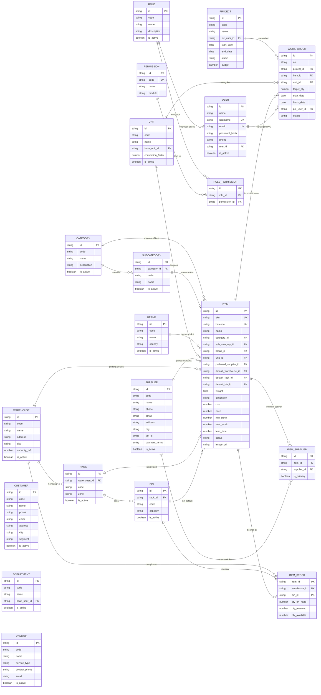

# ERD Master Data — KelolaGudang Pro

> Analisis entity-relationship untuk modul **Master Data** (16 entitas). Konteks: proyek UI-only, seluruh data dummy deterministik di `src/lib/wms-data.ts`. Dokumen ini adalah blueprint normalisasi — kode saat ini masih memakai string denormalized (lihat §7). Dokumen ini adalah **subset master** dari `docs/erd-komprehensif.md` (ERD seluruh aplikasi, 31 entitas).

## 1. Ringkasan

Master Data adalah fondasi seluruh modul (`/transaksi`, `/persediaan`, `/pengadaan`, `/opname`, `/laporan`, `/barcode`). Semua modul lain hanya menampilkan/mengonsumsi data yang didefinisikan di sini. Tanpa Barang, Satuan, dan Gudang tidak ada stok yang bisa dicatat.

Dari 16 entitas: **12 core**, **3 peripheral**, **1 orphan**, plus **4 tabel jembatan** (ITEM_STOCK, ITEM_SUPPLIER, ROLE_PERMISSION, PERMISSION) yang dimodelkan langsung di diagram §2 — total **20 blok**.

## 2. Diagram ERD (alur kiri → kanan)

## 3. Penilaian fundamentalitas

| Entitas       | Status     | Alasan                                                        | Pemakai utama (dari kode)                                           |
| ------------- | ---------- | ------------------------------------------------------------- | ------------------------------------------------------------------- |
| Barang (ITEM) | **Core**   | Hub pusat stok; 21 atribut; direferensikan hampir semua modul | transaksi, persediaan, opname, pengadaan, laporan, barcode          |
| Kategori      | Core       | Klasifikasi wajib barang                                      | Item.category, filter master barang                                 |
| Sub Kategori  | Core       | Turunan kategori; ditampilkan di detail barang                | Item.subCategory                                                    |
| Merk          | Core       | Identifikasi & filter barang                                  | Item.brand, filter master barang                                    |
| Satuan        | Core       | Semua qty stok butuh unit                                     | Item, `Trx.lines`, `WorkOrder`, `ProcLine`                          |
| Gudang        | Core       | Stok multi-gudang                                             | Item, transaksi (asal/tujuan), PO, opname, laporan                  |
| Rak           | Core       | Lokasi penyimpanan                                            | Item.rack, tabel stock                                              |
| Bin Location  | Core       | Lokasi ter kecil (bin-level)                                  | Item.bin, tabel stock                                               |
| Supplier      | Core       | Sumber inbound & pengadaan                                    | Item.supplier, Barang Masuk, Retur Pembelian, PO, GR                |
| Customer      | Core       | Penerima outbound                                             | Barang Keluar, Retur Penjualan                                      |
| User          | Core       | PIC & audit trail                                             | `trx.pic`, `opname.pic`, `WO.pic`, `PR.requester`, `auditLogs.user` |
| Role          | Core       | Hak akses user                                                | User.role, audit log                                                |
| Departemen    | Peripheral | Hanya untuk pemakaian internal/produksi                       | Form Barang Keluar, PR/PO                                           |
| Proyek        | Peripheral | Hanya untuk bisnis berbasis proyek                            | Work Order, Form Barang Keluar                                      |
| Work Order    | Peripheral | Hanya untuk skenario produksi/manufaktur                      | Form Barang Keluar (target produksi)                                |
| Vendor        | **Orphan** | Tidak direferensikan modul mana pun                           | — (hanya menu master)                                               |

## 4. Relasi & kardinalitas

| #   | Dari        | Ke              | Kardinalitas | Bukti di kode                                |
| --- | ----------- | --------------- | ------------ | -------------------------------------------- |
| 1   | CATEGORY    | SUBCATEGORY     | 1 : N        | `generic-master.tsx:50` "Induk Kategori"     |
| 2   | CATEGORY    | ITEM            | 1 : N        | `Item.category`                              |
| 3   | SUBCATEGORY | ITEM            | 1 : N        | `Item.subCategory`                           |
| 4   | BRAND       | ITEM            | 1 : N        | `Item.brand`                                 |
| 5   | UNIT        | ITEM            | 1 : N        | `Item.unit`                                  |
| 6   | SUPPLIER    | ITEM            | 1 : N        | `Item.supplier`                              |
| 7   | WAREHOUSE   | RACK            | 1 : N        | `generic-master.tsx:92-96` "Gudang" tiap rak |
| 8   | RACK        | BIN             | 1 : N        | `generic-master.tsx:107` "Rak" tiap bin      |
| 9   | WAREHOUSE   | ITEM            | 1 : N        | `Item.warehouse` (gudang default)            |
| 10  | RACK        | ITEM            | 1 : N        | `Item.rack` (rak default)                    |
| 11  | BIN         | ITEM            | 1 : N        | `Item.bin` (bin default)                     |
| 12  | ROLE        | USER            | 1 : N        | `generic-master.tsx:193` kolom Role          |
| 13  | USER        | WORK_ORDER      | 1 : N        | `WorkOrder.pic`                              |
| 14  | PROJECT     | WORK_ORDER      | 1 : N        | `WorkOrder.project`                          |
| 15  | UNIT        | WORK_ORDER      | 1 : N        | `WorkOrder.unit`                             |
| 16  | ITEM        | WORK_ORDER      | 1 : N        | `WorkOrder.product` (target produksi)        |
| 17  | WAREHOUSE   | ITEM_STOCK      | 1 : N        | usulan normalisasi                           |
| 18  | BIN         | ITEM_STOCK      | 1 : N        | usulan normalisasi                           |
| 19  | ITEM        | ITEM_STOCK      | 1 : N        | usulan normalisasi                           |
| 20  | ITEM        | ITEM_SUPPLIER   | 1 : N        | usulan normalisasi                           |
| 21  | SUPPLIER    | ITEM_SUPPLIER   | 1 : N        | usulan normalisasi                           |
| 22  | ROLE        | ROLE_PERMISSION | 1 : N        | usulan normalisasi                           |
| 23  | PERMISSION  | ROLE_PERMISSION | 1 : N        | usulan normalisasi                           |

**Relasi keluar (konsumen master, bukan bagian master):**

- TRANSACTION → WAREHOUSE, SUPPLIER/CUSTOMER (partner), DEPARTMENT/PROJECT/WORK_ORDER (tujuan internal/produksi), ITEM (lines), USER (PIC) — `wms-data.ts:249-335`
- PURCHASE_ORDER/PR/GR → SUPPLIER, WAREHOUSE, DEPARTMENT, USER (requester), ITEM (lines) — `wms-data.ts:549-624`
- OPNAME_SESSION → WAREHOUSE, USER (PIC); OPNAME_LINE → ITEM — `wms-data.ts:410-538`

## 5. Atribut lengkap per entitas

Detail tipe & contoh nilai dummy untuk entitas core:

| Entitas         | Atribut (PK/FK/UK ditandai)                                                                                                                                                                                                                                                                                          | Contoh nilai                                                 |
| --------------- | -------------------------------------------------------------------------------------------------------------------------------------------------------------------------------------------------------------------------------------------------------------------------------------------------------------------- | ------------------------------------------------------------ |
| **CATEGORY**    | `id` PK, `code`, `name`, `description`, `is_active`                                                                                                                                                                                                                                                                  | KAT-001 / "Sparepart Mesin"                                  |
| **SUBCATEGORY** | `id` PK, `category_id` FK→CATEGORY, `code`, `name`, `is_active`                                                                                                                                                                                                                                                      | "Bearing" → Kategori "Sparepart Mesin"                       |
| **BRAND**       | `id` PK, `code`, `name`, `country`, `is_active`                                                                                                                                                                                                                                                                      | MRK-001 / "SKF" / "Jepang"                                   |
| **UNIT**        | `id` PK, `code`, `name`, `base_unit_id` FK→UNIT (self), `conversion_factor`, `is_active`                                                                                                                                                                                                                             | PCS / "1 DUS = 24 PCS"                                       |
| **WAREHOUSE**   | `id` PK, `code`, `name`, `address`, `city`, `capacity_m3`, `is_active`                                                                                                                                                                                                                                               | GD-01 / "Gudang Pusat Jakarta" / "Jakarta Timur" / 2000 m³   |
| **RACK**        | `id` PK, `warehouse_id` FK→WAREHOUSE, `code`, `zone`, `is_active`                                                                                                                                                                                                                                                    | RAK-A1 / zona A                                              |
| **BIN**         | `id` PK, `rack_id` FK→RACK, `code`, `capacity`, `is_active`                                                                                                                                                                                                                                                          | BIN-1A / okupansi 40%                                        |
| **ITEM**        | `id` PK, `sku` UK, `barcode` UK, `name`, `category_id` FK, `sub_category_id` FK, `brand_id` FK, `unit_id` FK, `preferred_supplier_id` FK, `default_warehouse_id` FK, `default_rack_id` FK, `default_bin_id` FK, `weight`, `dimension`, `cost`, `price`, `min_stock`, `max_stock`, `lead_time`, `status`, `image_url` | SKU-10001-001 / "Bearing 6205" / Rp 125.000                  |
| **SUPPLIER**    | `id` PK, `code`, `name`, `phone`, `email`, `address`, `city`, `tax_id`, `payment_terms`, `is_active`                                                                                                                                                                                                                 | SUP-001 / "PT Sinar Jaya Abadi" / NET 30                     |
| **CUSTOMER**    | `id` PK, `code`, `name`, `phone`, `email`, `address`, `city`, `segment`, `is_active`                                                                                                                                                                                                                                 | CUS-001 / "PT Maju 1" / Distributor                          |
| **DEPARTMENT**  | `id` PK, `code`, `name`, `head_user_id` FK→USER, `is_active`                                                                                                                                                                                                                                                         | DEP-001 / "Produksi" / "Bayu Pratama"                        |
| **PROJECT**     | `id` PK, `code`, `name`, `pic_user_id` FK→USER, `start_date`, `end_date`, `status`, `budget`                                                                                                                                                                                                                         | PRJ-001 / "Proyek Tol Cisumdawu" / "Rudi Hartono" / Berjalan |
| **WORK_ORDER**  | `id` PK, `no`, `project_id` FK, `item_id` FK→ITEM, `unit_id` FK→UNIT, `target_qty`, `start_date`, `finish_date`, `pic_user_id` FK→USER, `status`                                                                                                                                                                     | WO/2026/0001 / target 25 / "Selesai"                         |
| **USER**        | `id` PK, `name`, `username` UK, `email` UK, `password_hash`, `phone`, `role_id` FK→ROLE, `is_active`                                                                                                                                                                                                                 | "Rudi Hartono" / Operator Gudang                             |
| **ROLE**        | `id` PK, `code`, `name`, `description`, `is_active`                                                                                                                                                                                                                                                                  | ROL-001 / "Administrator" / 24 modul                         |
| **VENDOR**      | `id` PK, `code`, `name`, `service_type`, `contact_phone`, `email`, `is_active`                                                                                                                                                                                                                                       | VDR-001 / "PT Vendor Logistik 1" / Ekspedisi                 |

## 6. Tabel jembatan

Entitas tambahan yang membuat ERD jujur terhadap cara kerja WMS:

- **ITEM_STOCK** — PK komposit `(item_id, warehouse_id, bin_id)` (`bin_id` opsional bila tanpa bin), kolom `qty_on_hand`, `qty_reserved`, `qty_available` (derived `on_hand − reserved`). Memindahkan `stock`/`reserved` keluar dari ITEM agar stok bisa dilacak per lokasi.
- **ITEM_SUPPLIER** (`id` PK, `item_id` FK→ITEM, `supplier_id` FK→SUPPLIER, `is_primary`) — mendukung banyak pemasok per barang.
- **ROLE_PERMISSION** + **PERMISSION** — mendukung klaim "Hak Akses X modul" pada Role.

## 7. Mapping kode saat ini → ERD

Field string denormalized di `Item` (`wms-data.ts:124-150`) dan cara normalisasinya:

| Field saat ini       | Nilai (dummy)          | Normalisasi menjadi                                  |
| -------------------- | ---------------------- | ---------------------------------------------------- |
| `category`           | "Sparepart Mesin"      | `category_id` → CATEGORY                             |
| `subCategory`        | "Bearing"              | `sub_category_id` → SUBCATEGORY                      |
| `brand`              | "SKF"                  | `brand_id` → BRAND                                   |
| `unit`               | "PCS"                  | `unit_id` → UNIT                                     |
| `supplier`           | "PT Sinar Jaya Abadi"  | `preferred_supplier_id` → SUPPLIER (+ ITEM_SUPPLIER) |
| `warehouse`          | "Gudang Pusat Jakarta" | `default_warehouse_id` → WAREHOUSE                   |
| `rack`               | "RAK-A1"               | `default_rack_id` → RACK                             |
| `bin`                | "BIN-1A"               | `default_bin_id` → BIN                               |
| `stock` / `reserved` | 125 / 5                | `ITEM_STOCK.qty_on_hand` / `qty_reserved`            |

## 8. Temuan & rekomendasi

1. **Item saat ini denormalized** — 9 field merujuk entitas lain sebagai teks. Untuk ERD komprehensif, pecah ke FK + tabel `ITEM_STOCK`.
2. **Vendor orphan** — tidak direferensikan modul mana pun (`grep` hanya `generic-master.tsx` + `nav.ts`). Pertahankan sebagai entitas opsional untuk logistik/ekspedisi di masa depan, atau hapus dari menu.
3. **Rak/Bin belum berelasi nyata ke Item** — tabelnya di-generate mandiri (`generic-master.tsx:87-112`); tidak ada jaminan `item.rack` ada di tabel rak.
4. **SubKategori↔Barang bukan relasi nyata** — keduanya dipilih acak di dummy; "Induk Kategori" di UI difabrikasi. Relasi pada ERD adalah usulan normalisasi.
5. **Daftar Role tidak konsisten** — master Role: Administrator/Supervisor/Operator Gudang/Auditor/Viewer; audit log memakai Admin/Purchasing. Perlu penyelarasan saat normalisasi.
